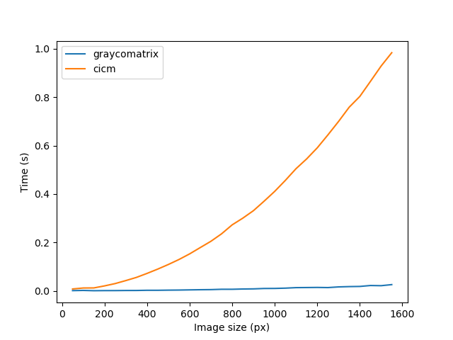

# CICM
Implementation of a cross-image co-occurrence matrix (CICM) in python, which computes a version of the common gray-level co-ocurrence matrix (GLCM) between different images, or channels of the same image.

Python's package scikit-image implements the calculation of the GLCM matrix through method [graycomatrix](https://scikit-image.org/docs/stable/api/skimage.feature.html#skimage.feature.graycomatrix) in the [feature module](https://scikit-image.org/docs/stable/api/skimage.feature.html). However, since this method only accepts one image as parameter, it is not possible to compare pixel co-occurrence between pixels from different images. 

This repository provides a similar functionality as that of method graycomatrix, with the addition of a second image argument to compare pixels with. Run tests show average computation times in the order of O(n^5) as a function of the image size (constant gray level), and O(log(N)) as a function of the number of gray levels (for constant image size), which is fast enough for common image sizes.

     
    
    
<i>Performance graphs for method cicm compared with scikit-image's graycomatrix. Computation times as a function of the number of gray levels (left), and image size (right).</i>

